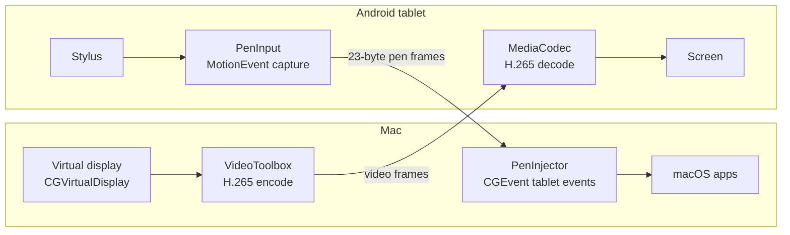
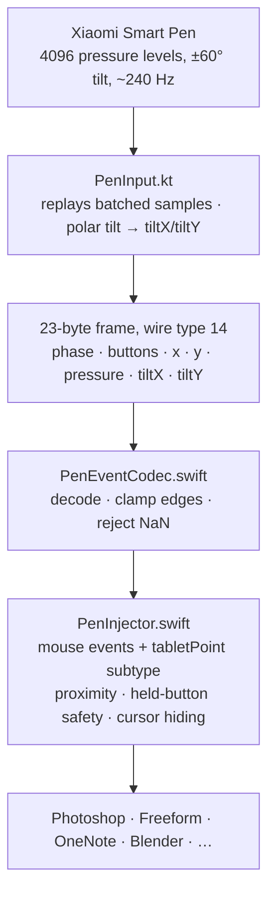
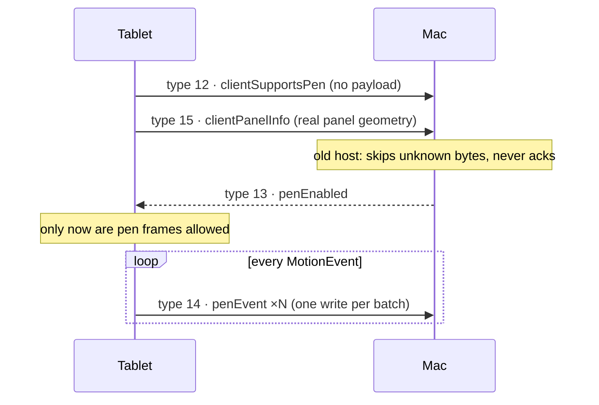

# VirtualPenTab

**Turn an Android tablet and its stylus into a pressure- and tilt-sensitive graphics tablet for your Mac — over USB or Wi-Fi, with the tablet doubling as a second display.**

A fork of [SideScreen](https://github.com/tranvuongquocdat/SideScreen) that adds real pen input. Validated end-to-end on a **Xiaomi Pad 5 + Xiaomi Smart Pen → macOS 26**.

```
Mac desktop ──H.265──▶ tablet screen        (SideScreen already did this)
Mac apps    ◀──pen───  tablet stylus        (this fork adds this)
```

---

## Why

Every open-source "tablet as second display" tool treats the stylus as a finger. None of them deliver **pressure or tilt** to macOS, so drawing apps see a mouse, not a pen:

| Project | Second display | Pen pressure on macOS |
|---|---|---|
| [SideScreen](https://github.com/tranvuongquocdat/SideScreen) | ✅ | ❌ touch only — could not even draw a continuous line ([#45](https://github.com/tranvuongquocdat/SideScreen/issues/45)) |
| [Deskreen](https://github.com/pavlobu/deskreen) | ✅ | ❌ no input at all |
| [BetterCast](https://github.com/StephenLovino/BetterCast) | ✅ | ❌ |
| [Weylus](https://github.com/H-M-H/Weylus) | ✅ | ⚠️ **Linux only** |
| **VirtualPenTab** | ✅ | **✅ pressure, two-axis tilt, hover, barrel buttons** |

The hardware has always had the data. The Pad 5's digitizer reports **4096 pressure levels and ±60° tilt on two independent axes**; macOS has accepted synthetic tablet events since the Wacom era. Nobody had wired the two together.

## What

| Feature | Status | Notes |
|---|---|---|
| Pressure | ✅ verified | Varies stroke width in OneNote, Freeform, any app reading `NSEvent.pressure` |
| Tilt (X and Y) | ✅ carried | Two independent axes, not collapsed to one. *Sign convention unverified — see [Status](#status)* |
| Hover | ✅ verified | Cursor tracks the pen before it touches; arrow hides while the pen is in range |
| Barrel button → right-click | 🔧 implemented | Not yet exercised on hardware |
| Eraser tip | 🔧 implemented | Not yet exercised on hardware |
| Continuous strokes | ✅ verified | Fixes upstream #45 — a pen is absolute pointing, not a trackpad gesture |
| USB and Wi-Fi | ✅ both verified | USB via `adb reverse`; Wi-Fi via QR pairing |
| Display advisor | ✅ verified | Tablet reports its real panel; host recommends resolution / HiDPI / refresh / bitrate |
| Live reconfiguration | ✅ verified | Change resolution, HiDPI, refresh or rotation **without dropping the connection** |
| Adaptive bitrate | ✅ verified on Wi-Fi | AIMD backoff when the link can't keep up; recovers without oscillating |
| Redesigned Mac app | ✅ | Sidebar navigation, resizable, Start/Stop always visible, QR first in wireless mode |

Plus everything SideScreen already had: virtual display, H.265 hardware encode/decode, multi-touch gestures, HiDPI, headless mode.

## How it works

Two independent streams flow in opposite directions over one TCP connection.



### The pen path



Three details that decide whether strokes feel right:

- **Every batched sample is replayed.** Android coalesces the pen's ~240 Hz stream to the display's vsync; reading only the latest position throws most of it away and gives polygonal strokes.
- **Tilt stays two-dimensional.** Android reports polar tilt + azimuth; macOS wants Cartesian tiltX/tiltY. Collapsing to one value discards pen direction.
- **Both pressure fields are set.** Apps read `NSEvent.pressure`, which is backed by `kCGMouseEventPressure`, *not* `kCGTabletEventPointPressure`. Set only the tablet field and every stroke arrives at full pressure. This one cost an afternoon.

### The handshake

Pen frames are never sent to a host that hasn't said it understands them, so a mismatched client/host pair degrades to plain touch instead of corrupting the input stream.



### Measured on the reference hardware

| | USB | Wi-Fi (5 GHz, −69 dBm) |
|---|---|---|
| Round-trip ping | 3.3–4.2 ms | ~10 ms |
| Tablet decode | 8.8 ms avg | 14–16 ms avg |
| Dropped frames | 0 / 31 000+ | 0 |
| Pen → ink (estimated) | 30–45 ms | 40–55 ms |

A static handwriting page compresses at roughly **1300 : 1** — 2.65 MB raw frames going out as ~2 KB. That ratio is why the codec is non-negotiable: raw 2560×1600 at 60 fps is 2.9 Gbit/s against a USB 2.0 cable that carries ~300 Mbit/s.

## Quick start

**Requirements:** macOS 13+ (validated on 26), Xcode Command Line Tools, Android 9+ tablet with a stylus, USB-debugging enabled. For building the Android client: JDK 17 and the Android SDK (`sdkmanager` handles the rest).

```bash
git clone https://github.com/ankitmundada/VirtualPenTab.git
cd VirtualPenTab

# Mac host
./scripts/build_mac.sh            # produces SideScreen.app
open SideScreen.app

# Android client
cd AndroidClient
./gradlew assembleDebug
adb install -r app/build/outputs/apk/debug/app-debug.apk
```

Then on the Mac press **Start**, and on the tablet open the app and connect (USB just works; Wi-Fi scans the QR shown on the Connect tab).

### Two macOS permissions

Both under **System Settings → Privacy & Security**:

| Permission | Needed for | If missing |
|---|---|---|
| **Screen Recording** | Capturing the virtual display | Nothing streams |
| **Accessibility** | Injecting pen and touch events | **Video looks perfect, pen does nothing.** `CGEvent.post` fails silently. |

### Stop macOS asking every rebuild

An ad-hoc signature has no certificate, so macOS identifies the app by its binary hash and treats every rebuild as a new app. Create a free self-signed certificate once — **Keychain Access → Certificate Assistant → Create a Certificate**, name `SideScreen Local Signing`, type *Code Signing* — and `build_mac.sh` picks it up automatically. No trust setting needed. Full walkthrough in [docs/pen-support.md](docs/pen-support.md).

### Xiaomi / MIUI note

`adb install` fails with `INSTALL_FAILED_USER_RESTRICTED` until you enable **Install via USB** and **USB debugging (Security settings)** in Developer options. MIUI may insist on a signed-in Mi account first; Wireless debugging sidesteps it.

## Things learned the hard way

Each of these looked like it worked until it didn't. Kept here because they're the kind of thing you only find by running the code on real hardware.

| Symptom | Cause | Fix |
|---|---|---|
| Strokes draw at constant width | Only the tablet pressure field was set; apps read the mouse one | Set `kCGMouseEventPressure` too — real Wacom hardware sets both |
| Menu text tiny after "HiDPI" | Virtual display published two modes; macOS adopted the 1× anchor | Select the 2× mode explicitly after the display settles |
| Rotated display comes out squashed | Rotation reoriented the client but never rebuilt the Mac's display | Rotation now rebuilds the display — without dropping the client |
| Changing any display setting disconnects the tablet | Resolution change did `stopServer()` + `startServer()` | Rebuild display and capture in place; keep the socket |
| Mac app hangs on connect | Encoder reconfigured on the main thread inside a `@Published` setter — a blocking XPC call | All encoder work on a dedicated queue |
| Adaptive bitrate dives to the floor in 3 s | Congestion measured as *peak* in-flight bytes — one keyframe exceeded the threshold | Measure the *trough*: did the queue ever drain? |
| Tilt at exactly 90° reads full-scale on the wrong axis | `cos(π/2)` in Float is `−4.4e-8`; `atan2(0, −tiny)` = π | Snap sub-epsilon components to zero |
| Permissions re-requested after every build | Ad-hoc signing → new cdhash per build | Self-signed certificate; trust not required |

## Status

**Verified on hardware:** pressure, hover, continuous strokes, cursor hiding, HiDPI, rotation, live reconfiguration, USB and Wi-Fi transport, adaptive bitrate under real congestion.

**Implemented, not yet hardware-verified:**
- **Tilt sign convention.** The math is unit-tested, but which physical direction is +tiltX on the Xiaomi digitizer has not been confirmed. If a tilt-sensitive brush feels mirrored, it's a one-line sign flip in `PenTilt.toCartesian`. `tools/capture-tilt.sh` records the raw digitizer values to settle it.
- Barrel-button right-click and eraser tip.

**Known limitations:**
- Rebuilding the virtual display (rotation, resolution) makes macOS move its windows to the main display. Positions could be restored via the Accessibility API; Spaces assignment cannot — macOS doesn't expose it.
- Hover is in-range / out-of-range only; the digitizer reports no graded height.
- Link bandwidth for the advisor is a conservative constant, not measured. The adaptive controller makes this mostly moot.

**Tests:** 115 checks on the Mac side (`swift run CoreTests`), 16 on Android (`./gradlew testDebugUnitTest`). XCTest isn't available without full Xcode, so the Swift tests run as a plain executable.

## Repository layout

```
MacHost/
  PenCore/          pen types + wire codec + CGEvent construction   (pure, tested)
  DisplayCore/      panel geometry, display advisor, bitrate control (pure, tested)
  CoreTests/        the test runner
  Sources/          the app: PenInjector, StreamingServer, SettingsWindow, …
AndroidClient/      Kotlin client: PenInput, PenEvent, PanelInfo, StreamClient
docs/
  pen-support.md          setup, permissions, troubleshooting
  pen-support-design.md   design rationale, hardware measurements, protocol
tools/
  penspike/         standalone validator: do synthetic tablet events survive macOS?
  capture-tilt.sh   read raw tilt from the digitizer
```

## Credits

Built on [SideScreen](https://github.com/tranvuongquocdat/SideScreen) by [@tranvuongquocdat](https://github.com/tranvuongquocdat) — the virtual display, video pipeline, transport and touch gestures are theirs. Forked at [`4f1a05b`](https://github.com/tranvuongquocdat/SideScreen/commit/4f1a05b). The stuck-button teardown safety follows the approach in upstream [PR #46](https://github.com/tranvuongquocdat/SideScreen/pull/46).

Developed with [Claude Code](https://claude.com/claude-code).

## License

[MIT](LICENSE) — same as upstream.
